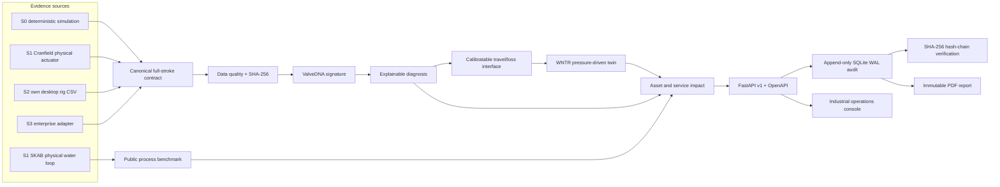

# Architecture

SmartValve AI Twin separates evidence acquisition, valve diagnosis and network consequence so that a public rig result cannot silently become a manufacturer claim.

## Service boundary

- Core diagnostics are pure Python and do not depend on Streamlit.
- FastAPI validates bounded request schemas and returns a versioned result.
- Every API diagnosis receives a UUID, correlation ID, operator ID, evidence grade, model version and baseline/current data digests.
- Streamlit is a presentation client only; simulation, public-rig and uploaded CSV diagnostics all cross the same HTTP boundary.
- The validation replay uses a dedicated read-only Cranfield sample endpoint; only explicit
  diagnostic commands append to the audit chain.
- SQLite uses WAL, append-only triggers, full result payloads and a verifiable SHA-256 record chain.
- Production mode requires a 32+ character API key and `X-Operator-ID`; development can run locally without a key.
- `/health/live`, `/health/ready` and `/metrics` support deployment probes.
- `make demo` binds to loopback and supervises API/dashboard together. Compose adds digest-pinned
  shell-less Chainguard runtime images, hash-locked dependencies, non-root/read-only services,
  localhost ports and API readiness ordering.

## Calibration boundary

The available-travel to WNTR TCV-loss mapping is replaceable and currently illustrative. An enterprise PoC must replace it with a product-specific Kv/Cv curve or a fitted test-rig mapping. Public actuator data validates the data and signature path, not that mapping.
